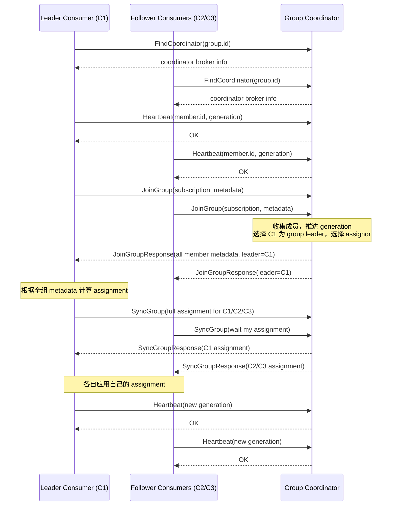

# Kafka Consumer Group Rebalance 宏观流程与 Broker/Consumer 交互

## 一句话定义

Consumer group rebalance 是 Kafka 在消费组成员、订阅范围或 topic partition
发生变化后，重新决定每个 consumer 负责哪些 partitions 的过程。

它不迁移 topic 数据，不移动 broker 上的 partition，也不改变 topic 本身。
它重新分配的是消费组内部的 partition 消费权。

## 主要角色

- Consumer group：使用同一个 `group.id` 的一组 consumers。
- Consumer：消费组里的成员。
- Group Coordinator：负责这个 consumer group 成员管理、心跳、offset commit
  和 rebalance 协调的 broker。
- Group leader：classic 协议中，由 coordinator 选出的某个 consumer，负责计算
  partition assignment。
- Partition assignor：分配策略，例如 range、round-robin、sticky、
  cooperative-sticky。
- Partition leader broker：真正提供消息 fetch 的 broker。它不等同于 group
  coordinator。

一个容易混淆的点是：rebalance 期间主要和 consumer 交互的是 group coordinator；
rebalance 完成后，consumer 拉取数据时访问的是各个 partition 的 leader broker。

## 什么时候会触发 Rebalance

常见触发条件：

- 新 consumer 加入 group。
- consumer 正常退出 group。
- consumer 崩溃、网络断开或心跳超时。
- consumer 太久没有调用 `poll()`，超过 `max.poll.interval.ms`。
- consumer 的订阅 topic 发生变化。
- regex 订阅匹配到了新 topic。
- topic 增加了 partitions。
- group coordinator 迁移。
- 静态成员被同一个 `group.instance.id` 的新实例替换。
- 分配协议或成员元数据发生变化。

这些事件的本质是：coordinator 认为当前 assignment 不能再代表真实的 group
状态，需要重新建立 partition 所有权关系。

## 宏观流程

一次 rebalance 可以概括成下面几步：

```text
发现成员、订阅或 partition 变化
  -> group 进入 rebalance 状态
  -> consumer 上报成员信息和订阅信息
  -> 选择分配策略并计算新的 assignment
  -> coordinator 把新 assignment 下发给每个 consumer
  -> consumer 撤销旧 partitions，初始化新 partitions
  -> group 重新进入 stable 状态
```

假设 topic `orders` 有 6 个 partitions：

```text
orders-0
orders-1
orders-2
orders-3
orders-4
orders-5
```

一开始 group 中有两个 consumers：

```text
C1 -> orders-0, orders-1, orders-2
C2 -> orders-3, orders-4, orders-5
```

当 `C3` 加入后，rebalance 后可能变成：

```text
C1 -> orders-0, orders-1
C2 -> orders-2, orders-3
C3 -> orders-4, orders-5
```

这个过程不是移动数据，而是改变 `orders-*` 这些 partitions 在当前 consumer group
中的 owner。

## Classic 协议中的 Broker/Consumer 交互

classic consumer group 协议大体是：

```text
FindCoordinator
  -> Heartbeat
  -> JoinGroup
  -> leader consumer 计算 assignment
  -> SyncGroup
  -> Heartbeat
```

更完整的交互如下。这里假设 coordinator 选出 `C1` 作为 group leader，
`C2/C3` 是普通 followers：



### 1. Consumer 找到 Coordinator

consumer 启动后会先发送 `FindCoordinator` 请求。coordinator 的选择和
`group.id` 有关。

Kafka 把 group 元数据保存在内部 topic `__consumer_offsets` 的某个 partition 上，
这个 partition 的 leader broker 就是该 group 的 coordinator。

所以第一步是：

```text
Consumer -> 任意 broker: FindCoordinator(group.id)
Broker -> Consumer: 这个 group 的 coordinator 是 broker-X
```

后续这个 group 的成员管理、心跳、offset commit 和 rebalance 协调，主要都访问
这个 coordinator。

### 2. 稳定状态下发送 Heartbeat

group 稳定时，每个 consumer 定期向 coordinator 发送 heartbeat：

```text
Consumer -> Coordinator: Heartbeat(group.id, member.id, generation.id)
Coordinator -> Consumer: OK
```

几个关键字段：

- `group.id`：消费组 ID。
- `member.id`：consumer 加入 group 后由 coordinator 分配的成员 ID。
- `generation.id`：当前 group generation。每完成一次 rebalance，generation 都会变化。
- `group.instance.id`：静态成员 ID，可选。

`generation.id` 用来防止旧成员继续以旧身份提交 offset 或声明 partition 所有权。
consumer 后续 heartbeat、offset commit 等请求都需要带上当前 generation。

### 3. Coordinator 发现需要 Rebalance

rebalance 可能由 consumer 请求触发，也可能由 coordinator 的定时器触发。

consumer 主动触发的例子：

```text
新 consumer 发送 JoinGroup
老 consumer 正常关闭时发送 LeaveGroup
consumer 订阅变化后请求重新加入
```

coordinator 被动发现的例子：

```text
某个 consumer 停止 heartbeat
超过 session.timeout.ms
coordinator 判定该 member 失效
```

一旦 coordinator 判断当前 assignment 已经过期，它会让 group 进入 rebalance 状态。
老 consumer 如果继续 heartbeat，可能收到 `REBALANCE_IN_PROGRESS`，于是知道自己需要
重新加入 group。

### 4. 所有 Consumer 进入 JoinGroup 阶段

rebalance 不是只有新 consumer 参与。通常老成员也要重新发送 `JoinGroup`，
因为 coordinator 需要重新收集全组成员信息。

`JoinGroup` 中通常包含：

- group id；
- member id；
- session timeout；
- rebalance timeout；
- 当前订阅 topic；
- 支持的 assignors；
- 上一轮拥有的 partitions；
- 用户自定义 metadata；
- 静态成员 instance id。

示例：

```text
C1 -> Coordinator: JoinGroup(订阅 orders, 支持 range/sticky)
C2 -> Coordinator: JoinGroup(订阅 orders, 支持 range/sticky)
C3 -> Coordinator: JoinGroup(订阅 orders, 支持 range/sticky)
```

coordinator 会等待成员重新加入，直到：

- 已知成员都重新加入；
- 或等待超时；
- 或某些动态成员被判定失效并移除。

### 5. Coordinator 选择 Generation、Leader 和 Assignor

JoinGroup 收齐后，coordinator 会：

- 推进 generation，例如 `generation 5 -> generation 6`。
- 选择一个 group leader。
- 从成员共同支持的协议中选择 assignor。

这里的 group leader 是 consumer group 内的 leader，不是 partition leader，
也不是 broker leader。

coordinator 给 leader 返回所有成员的订阅和 metadata；普通 follower 只知道自己的
member id、generation、leader 是谁，以及选中的协议。

### 6. Group Leader Consumer 计算 Assignment

classic 协议中，具体 partition assignment 通常由 group leader consumer 计算，
不是 broker 直接计算。

例如 coordinator 告诉 `C1`：

```text
你是 leader
当前成员有 C1, C2, C3
他们都订阅 orders
orders 有 6 个 partitions
使用 sticky assignor
```

`C1` 计算出：

```text
C1 -> orders-0, orders-1
C2 -> orders-2, orders-3
C3 -> orders-4, orders-5
```

coordinator 在 classic 协议中的重点职责是成员管理、generation 管理和流程推进；
分配算法由客户端 assignor 实现。

### 7. 所有 Consumer 发送 SyncGroup

JoinGroup 之后，每个 consumer 都会发送 `SyncGroup`。

leader 的 `SyncGroup` 会携带完整 assignment：

```text
C1 -> Coordinator: SyncGroup({
  C1: [orders-0, orders-1],
  C2: [orders-2, orders-3],
  C3: [orders-4, orders-5]
})
```

followers 的 `SyncGroup` 通常只是等待自己的结果：

```text
C2 -> Coordinator: SyncGroup()
C3 -> Coordinator: SyncGroup()
```

coordinator 收到 leader 的 assignment 后，把每个成员自己的那份返回给它：

```text
Coordinator -> C1: 你负责 orders-0, orders-1
Coordinator -> C2: 你负责 orders-2, orders-3
Coordinator -> C3: 你负责 orders-4, orders-5
```

### 8. Consumer 应用新 Assignment

consumer 收到新 assignment 后，会在本地执行：

- 停止或暂停不再拥有的 partitions。
- 提交旧 partitions 的 offsets。
- 调用 `onPartitionsRevoked` 或 `onPartitionsLost`。
- 清理旧 partitions 的本地状态。
- 添加新 partitions。
- 根据 committed offset、`auto.offset.reset` 或用户 seek 初始化消费位置。
- 调用 `onPartitionsAssigned`。
- 恢复 fetch。

恢复消费时，consumer 是向 partition leader broker 拉数据，不是向 coordinator 拉数据：

```text
Consumer -> Partition leader broker: Fetch(records)
Partition leader broker -> Consumer: records
```

但 offset commit 仍然通常发给 coordinator：

```text
Consumer -> Coordinator: OffsetCommit(group.id, generation.id, offsets)
Coordinator -> Consumer: OK
```

### 9. Group 重新进入 Stable

当所有成员完成 `SyncGroup` 并拿到自己的 assignment 后，coordinator 认为这一代
group 已经稳定。

之后重新回到正常 heartbeat：

```text
Consumer -> Coordinator: Heartbeat(generation=6)
Coordinator -> Consumer: OK
```

直到下一次成员、订阅或 partition 状态变化。

## Consumer 崩溃和正常退出的差异

consumer 正常退出时可以主动发送 `LeaveGroup`：

```text
Consumer -> Coordinator: LeaveGroup
Coordinator -> Consumer: OK
```

coordinator 可以立即移除该 member，并触发后续 rebalance。

consumer 崩溃时不会发送 `LeaveGroup`。coordinator 只能等待 heartbeat 超时：

```text
C2 不再 heartbeat
  -> 超过 session.timeout.ms
  -> coordinator 判定 C2 dead
  -> coordinator 触发 rebalance
  -> 其余成员重新 JoinGroup
  -> C2 原来的 partitions 被重新分配
```

所以崩溃离开通常比正常退出慢，因为它依赖 timeout 检测。

## Eager 和 Cooperative 的交互差异

### Eager Rebalance

传统 eager 模式更像全量重分配：

```text
所有 consumers 放弃所有 partitions
  -> JoinGroup
  -> SyncGroup
  -> 所有 consumers 重新获得 partitions
```

优点是简单。缺点是影响范围大，即使只需要迁移一个 partition，很多 consumer
也会暂停消费。

### Cooperative Rebalance

cooperative 模式是增量重分配：

```text
能不动的 partitions 尽量不动
只撤销确实需要迁移出去的 partitions
```

例如原来：

```text
C1 -> p0, p1, p2
C2 -> p3, p4, p5
```

加入 `C3` 后目标是：

```text
C1 -> p0, p1
C2 -> p2, p3
C3 -> p4, p5
```

cooperative 不会要求所有成员先清空 assignment，而是让 `C1` 释放 `p2`，
让 `C2` 释放 `p4, p5`，之后再把这些 partitions 分给目标 consumer。

它有时需要多一轮 rebalance，因为 Kafka 要确保一个 partition 不会同时被两个
consumer 拥有。这个约束比“少一轮交互”更重要。

## Offset 和 Rebalance 的关系

rebalance 改变的是 partition owner。owner 改变时，offset 决定新 owner 从哪里继续消费。

如果 `C1` 失去 `orders-2` 前已经提交：

```text
orders-2 committed offset = 1000
```

那么接手的 `C2` 可以从 1000 之后继续消费。

如果 `C1` 处理了消息但还没有提交 offset，`C2` 接手后可能从旧 offset 重新消费，
造成重复处理。

所以 rebalance 前提交 offset 的目的，是降低 partition 转移时的重复消费概率。
它不能单独提供 exactly-once 语义。

## 新版 Consumer Group Protocol 的差异

新版 consumer group protocol 不再是 classic 的 `JoinGroup -> SyncGroup` 两阶段模式。
它更像 heartbeat 驱动的持续协调：

```text
ConsumerGroupHeartbeat
  -> coordinator 更新 member epoch、group epoch、target assignment
  -> heartbeat response 返回 assignment
  -> consumer 在 poll/reconciliation 中逐步应用 assignment
```

新版协议中，coordinator 会维护 target assignment，并通过 heartbeat response
把目标分配告诉 consumer。consumer 收到目标 assignment 后进入 reconciliation：

- 提交需要提交的 offsets。
- 暂停待撤销 partitions。
- 调用 revoke/lost callbacks。
- 应用新 assignment。
- 调用 assigned callback。
- 确认 member epoch。

这和 classic 协议最大的区别是：classic 的 assignment 由 consumer group leader
在 JoinGroup/SyncGroup 流程中一次性提交；新版协议由 coordinator 维护 target
assignment，并通过 heartbeat 和 member epoch 让成员逐步收敛到目标状态。

## 为什么 Rebalance 会导致消费变慢

rebalance 期间可能发生：

- consumer 暂停 fetch 部分或全部 partitions。
- consumer 需要提交 offset。
- consumer 需要执行 revoke/assigned callbacks。
- 新 partitions 需要初始化 offset。
- 应用需要恢复本地缓存或状态。
- Kafka Streams 可能需要恢复 state store。
- 频繁 rebalance 会让 group 长时间无法稳定。

rebalance 本身不是错误，但频繁 rebalance 通常说明 group 不稳定。

常见治理方向：

- 避免长时间阻塞 `poll()`。
- 合理设置 `session.timeout.ms`、`heartbeat.interval.ms`、`max.poll.interval.ms`。
- 使用 `cooperative-sticky` 降低全量停顿。
- 使用静态成员 `group.instance.id` 减少滚动重启时的抖动。
- 控制 consumer 上下线频率。
- 确保 rebalance callbacks 不做过慢或不可控的操作。

## 核心总结

rebalance 期间，broker 和 consumer 的分工是：

- Coordinator 负责判断 group 是否需要 rebalance、维护 generation、管理成员状态、
  协调 JoinGroup/SyncGroup 或 ConsumerGroupHeartbeat 流程。
- Classic 协议中的 group leader consumer 负责根据 assignor 计算具体 partition
  assignment。
- 普通 consumer 负责按 assignment 撤销旧 partitions、接手新 partitions、提交 offset
  并继续消费。
- Partition leader broker 负责 rebalance 完成后的实际消息 fetch。

因此，rebalance 的本质是：

```text
在消费组状态变化后，coordinator 和 consumers 通过协议交互，
重新建立一个一致、无冲突、可继续消费的 partition 所有权关系。
```
